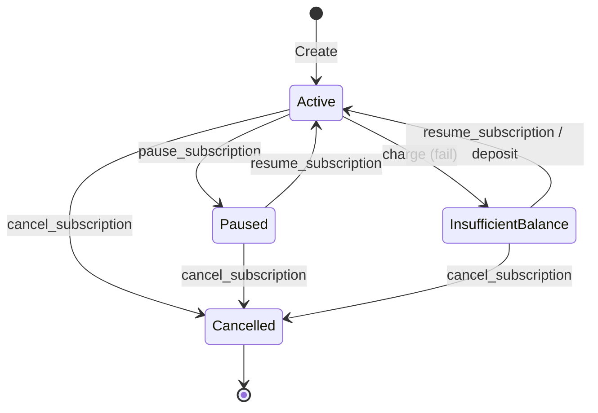

# Subscription Pause and Resume Semantics

This document describes the lifecycle controls for pausing and resuming subscriptions in the `subscription_vault` contract.

## Overview

Subscriptions can be temporarily suspended using the `pause_subscription` entrypoint. This prevents any further charges until the subscription is explicitly restored to the `Active` state via `resume_subscription`.

## Key Rules

1. **Authorization**:
   - Both the **Subscriber** and the **Merchant** have the authority to pause a subscription.
   - Both the **Subscriber** and the **Merchant** have the authority to resume a subscription.
   - Unauthorized addresses will receive an `Unauthorized` (401) error.

2. **Charging Paused Subscriptions**:
   - Charges are strictly prohibited while a subscription is in the `Paused` state.
   - Any attempt to charge a paused subscription will return a `NotActive` (1002) error.

3. **State Transitions**:
   - `Active` -> `Paused`: Allowed.
   - `Paused` -> `Active`: Allowed.
   - `InsufficientBalance` -> `Active`: Allowed (equivalent to resuming/retrying).
   - `Cancelled`: Terminal state; no transitions to `Paused` or `Active` are allowed.

4. **Billing Consistency**:
   - Pausing a subscription does not automatically shift the billing interval or `last_payment_timestamp`.
   - If a subscription is resumed after its next scheduled billing date has passed, it may be eligible for charging immediately upon resumption.

## State Diagram

## Events

- `SubscriptionPausedEvent`: Emitted when a subscription is successfully paused.
- `SubscriptionResumedEvent`: Emitted when a subscription is successfully resumed.
