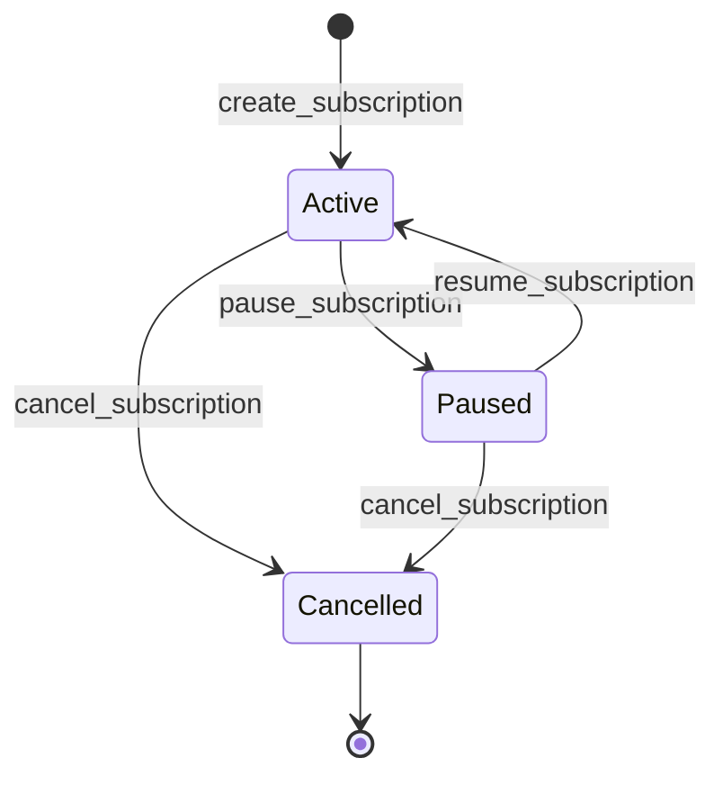

# Subscription Pause and Resume Semantics

This document outlines the state machine and logic for pausing and resuming subscriptions in the `subscription_vault` contract.

## State Machine

Subscriptions can transition between the following statuses:

- **Active**: The subscription is live and can be charged.
- **Paused**: The subscription is temporarily halted. No charges can be processed.
- **Cancelled**: The subscription is terminated.

### State Transitions

## Pause Semantics (`pause_subscription`)

- **Authorized Users**: Only the `subscriber` or the `merchant` can pause a subscription.
- **Preconditions**:
    - The subscription must exist (`Error::NotFound`).
    - The subscription must currently be in the `Active` state.
- **Effects**:
    - Status is updated to `SubscriptionStatus::Paused`.
    - `charge_subscription` will fail with an error if called on a paused subscription.

## Resume Semantics (`resume_subscription`)

- **Authorized Users**: Only the `subscriber` or the `merchant` can resume a subscription.
- **Preconditions**:
    - The subscription must exist (`Error::NotFound`).
    - The subscription must currently be in the `Paused` state.
- **Effects**:
    - Status is updated to `SubscriptionStatus::Active`.
    - `charge_subscription` can now be processed if other conditions (interval, balance) are met.

## Charging a Paused Subscription

The `charge_subscription` entrypoint explicitly checks the subscription status. If the status is `Paused`, the transaction will revert or return an error, preventing any funds from being transferred to the merchant until the subscription is resumed.

## Invariants

1. A subscription cannot be paused if it is already `Paused` or `Cancelled`.
2. A subscription cannot be resumed if it is `Active` or `Cancelled`.
3. Paused subscriptions maintain their `last_payment_timestamp` and `interval_seconds`. Resuming does not reset the billing cycle; it simply allows charges to resume based on the existing schedule.
